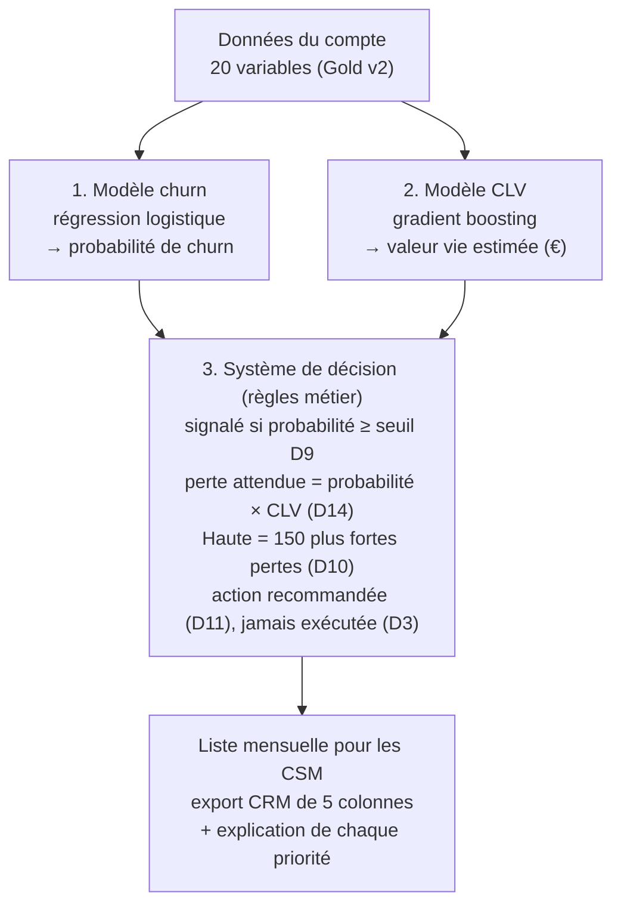

[← Documentation](../index.md)

# Besoin et solution

## Contexte

Un éditeur SaaS B2B tire ses revenus d'abonnements récurrents (plan × licences × usage). Sur les
5 000 comptes étudiés, **28 % résilient à l'échéance contractuelle** (churn). Chaque résiliation
coûte le revenu mensuel récurrent (MRR) et la valeur vie client (CLV) restante : **6 879 € en
médiane** pour les comptes qui partent.

## Besoin

Les équipes **Customer Success (CS)** veulent anticiper les comptes susceptibles de résilier, pour
concentrer leurs actions de rétention **avant l'échéance**. Leur capacité est limitée à
**150 comptes par cycle mensuel** ([D10](decisions/D10.md)).

La solution est un **outil d'aide à la décision** : elle hiérarchise les comptes et recommande une
action, elle ne remplace jamais le jugement d'un CSM par une exécution automatique
([D3](decisions/D03.md)). C'est une contrainte de l'énoncé et une condition de conformité (RGPD,
article 22 ; voir [RGPD et éthique](../donnees/rgpd_et_ethique.md)).

## Traduction en problème de données

| Question métier | Traduction technique |
|---|---|
| Ce compte va-t-il résilier à l'échéance ? | **Classification binaire** sur `churn` ([D2](decisions/D02.md)) |
| Combien vaut ce compte ? | **Régression** sur `valeur_vie_client_eur`, jamais utilisée comme variable du churn |
| Quels comptes appeler en premier, avec 150 appels par mois ? | **Système de décision** à base de règles, sans apprentissage |

## La solution : trois briques

| Brique | Nature | Documentation |
|---|---|---|
| 1. Modèle churn | Apprentissage supervisé (classification) | [Model card churn v2](../modeles/model_card_churn_v2.md) |
| 2. Modèle CLV | Apprentissage supervisé (régression) | [Model card CLV v2](../modeles/model_card_clv_v2.md) |
| 3. Système de décision | Règles métier, **sans apprentissage** | [Système de décision](../modeles/systeme_de_decision.md) |

Les deux modèles sont entraînés séparément et aucun ne sert de variable à l'autre : leurs sorties
ne se rencontrent que dans le système de décision. Les modèles disent **ce qui va probablement se
passer** ; le système de décision dit **quoi faire, pour qui, dans quel ordre**. Chaque priorité
est livrée avec son explication ([Explicabilité](../explicabilite/methode.md)).

## Résultats clés (modèle v2.1, jeu de test de 1 000 comptes, lu une seconde fois pour la v2.1)

| Indicateur | Valeur |
|---|---|
| PR-AUC du modèle churn / baseline métier | 0,748 / 0,593 : critère [D8](decisions/D08.md) respecté, marge faible (+0,154 pour +0,15 exigé) |
| Rappel et précision au seuil D9 (0,2832) | 82,5 % et 63,1 % |
| Comptes réellement partis parmi les 150 priorités Hautes | 102 (42 attendus au hasard) |
| Part de la perte réelle captée par les 150 priorités Hautes | 82 % |
| CLV : erreur relative médiane / corrélation de rang avec la valeur réelle | 42 % / 0,94 |

## Limites connues

- Un seul instantané des comptes : pas de validation dans le temps.
- La recette [D15](decisions/D15.md) n'est que partiellement satisfaite : les comptes de très
  grande valeur mais de risque modéré échappent à la liste.
- L'impact métier est **estimé**, pas mesuré : il le sera par le groupe témoin
  ([D12](decisions/D12.md)).
- La date de calcul de `derniere_connexion_jours` reste à confirmer auprès du propriétaire des
  données.

## Pour aller plus loin

- [Décisions de cadrage D1 à D15](decisions/index.md)
- [Hypothèses H01 à H05](hypotheses.md)
- [Notebook de certification exécuté](../../reports/notebooks/notebook_certifiant_churn_saas.ipynb), §1 et §2
