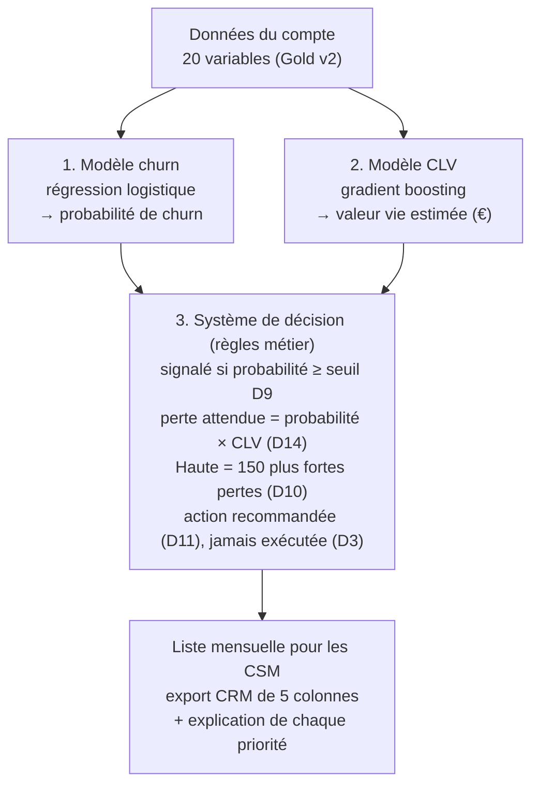

[← Documentation](../index.md)

# Besoin et solution

## Contexte

Un éditeur SaaS B2B tire ses revenus d'abonnements récurrents (plan × licences × usage). Sur les
5 000 comptes étudiés, **28 % résilient à l'échéance contractuelle** (churn). Chaque résiliation
coûte le revenu mensuel récurrent (MRR) et la valeur vie client (CLV) restante : **6 879 € en
médiane** pour les comptes qui partent.

## Besoin

Les équipes **Customer Success (CS)** veulent anticiper les comptes susceptibles de résilier, pour
concentrer leurs actions de rétention **avant l'échéance**. Leur capacité est limitée à
**150 comptes par cycle mensuel** ([D10](decisions/D10.md)).

La solution est un **outil d'aide à la décision** : elle hiérarchise les comptes et recommande une
action, elle ne remplace jamais le jugement d'un CSM par une exécution automatique
([D3](decisions/D03.md)). C'est une contrainte de l'énoncé et une condition d'adoption par les CSM.
Les comptes sont des entreprises : un appel de rétention n'engage pas l'article 22 du RGPD, dont
l'esprit est néanmoins respecté (voir [RGPD et éthique](../donnees/rgpd_et_ethique.md)).

## De la finalité aux exigences

Chaque mois, l'équipe CS appelle **150 comptes sur 5 000** (3 %), choisis par probabilité de churn
× valeur estimée, et envoie un email aux autres comptes signalés. Ce que l'on exige des données, des
modèles et de leur évaluation en découle (notebook §2.7) :

| La décision… | … exige | Où c'est traité |
|---|---|---|
| est prise chaque mois, avant l'échéance ([H06](hypotheses.md)) | des variables connues à la date du scoring | notebook §6.2, §6.4 |
| classe les comptes par probabilité × valeur ([D14](decisions/D14.md)) | des probabilités calibrées | notebook §9.4 |
| classe les comptes par probabilité × valeur | une valeur en jeu estimée pour chaque compte, et bien définie | notebook §9.7, §12.2, §12.3.1 |
| appelle 150 comptes sur 5 000, soit 3 % ([D10](decisions/D10.md)) | une évaluation à cette échelle | notebook §9.8, §12.3.1, §12.4 |
| cherche à préserver le plus de valeur possible | une règle de priorité cohérente avec la valeur, un retour sur investissement chiffré | notebook §9.8, §12.3.1 |
| doit pouvoir être contestée par le CSM ([D3](decisions/D03.md)) | une explication de chaque priorité | notebook §9.6, §10.2.1 |

La PR-AUC juge le classement par risque ; la **perte captée** par les appels juge la décision.

## Traduction en problème de données

| Question métier | Traduction technique |
|---|---|
| Ce compte va-t-il résilier à l'échéance ? | **Classification binaire** sur `churn` ([D2](decisions/D02.md)) |
| Combien vaut ce compte ? | **Régression** sur `valeur_vie_client_eur`, jamais utilisée comme variable du churn |
| Quels comptes appeler en premier, avec 150 appels par mois ? | **Système de décision** à base de règles, sans apprentissage |

## La solution : trois briques

| Brique | Nature | Documentation |
|---|---|---|
| 1. Modèle churn | Apprentissage supervisé (classification) | [Model card churn v2](../modeles/model_card_churn_v2.md) |
| 2. Modèle CLV | Apprentissage supervisé (régression) | [Model card CLV v2](../modeles/model_card_clv_v2.md) |
| 3. Système de décision | Règles métier, **sans apprentissage** | [Système de décision](../modeles/systeme_de_decision.md) |

Les deux modèles sont entraînés séparément et aucun ne sert de variable à l'autre : leurs sorties
ne se rencontrent que dans le système de décision. Les modèles disent **ce qui va probablement se
passer** ; le système de décision dit **quoi faire, pour qui, dans quel ordre**. Chaque priorité
est livrée avec son explication ([Explicabilité](../explicabilite/methode.md)).

## Résultats clés (modèle v2.1)

| Indicateur | Valeur |
|---|---|
| Classement par risque : PR-AUC du modèle churn / règle métier D8 (test) | 0,748 / 0,593 : critère [D8](decisions/D08.md) respecté, marge faible (+0,154 pour +0,15 exigé ; IC 95 % de +0,108 à +0,202) |
| Rappel et précision au seuil D9 (0,2832, test) | 82,5 % et 63,1 % |
| **Perte réelle captée à l'échelle de la production** (150 appels sur 5 000, soit 3 %) | **47 %** hors pli (IC 37 à 56 %) ; **59 %** sur le test avec 30 appels sur 1 000 ; maximum possible (oracle) 74 à 76 % |
| Précision des appels à 3 % (hors pli) : modèle / règle métier | 69 % / 40 % |
| Perte captée par 150 appels sur les 1 000 comptes du test (15 %) | 82 % (102 comptes partis parmi les appelés, 42 au hasard) |
| Seuil de rentabilité d'un cycle de production (coûts complets, [H07](hypotheses.md)) | **0,05 à 0,15 %** de la valeur couverte par les appels |
| CLV : erreur relative médiane / corrélation de rang avec la valeur réelle | 42 % / 0,94 |

Le chiffre de 82 % vaut pour une capacité cinq fois plus large que la production ; à l'échelle
réelle, les appels couvrent environ la moitié de la perte. Sur la perte captée, le modèle de churn,
la forêt, le boosting et la règle métier calibrée font jeu égal : c'est la valeur estimée qui
ordonne la liste. Le modèle apporte la précision des appels, des probabilités calibrées et
l'explication ([système de décision](../modeles/systeme_de_decision.md)).

## Limites connues

- Un seul instantané des comptes : pas de validation dans le temps.
- La recette [D15](decisions/D15.md) d'origine n'est pas satisfaite ; ses critères ont été révisés
  et le filet de sécurité ([D14](decisions/D14.md)) rattrape une partie des comptes de très grande
  valeur mais de risque modéré. La nouvelle recette se fera au premier cycle réel.
- L'impact métier est **estimé**, pas mesuré : il le sera par les groupes témoins
  ([D12](decisions/D12.md)), outillés mais jamais exécutés sur des issues réelles.
- Le filtre [D9](decisions/D09.md) ignore la valeur : sans lui, les appels couvriraient environ 55 %
  de la perte au lieu de 47 %, pour 6 points de précision en moins. Arbitrage soumis à la direction
  CS.
- La recette D15 (b') (≥ 75 %) est inatteignable à 3 % : elle doit être réexprimée en part de
  l'oracle avant le premier cycle réel.
- La date de calcul de `derniere_connexion_jours` et la définition de la CLV (qui inclut
  probablement du revenu déjà encaissé) restent à confirmer auprès du propriétaire des données.

## Pour aller plus loin

- [Décisions de cadrage D1 à D16](decisions/index.md)
- [Hypothèses H01 à H07](hypotheses.md)
- [Notebook de certification exécuté](../../reports/notebooks/notebook_certifiant_churn_saas.ipynb), §1, §2, §9.8 et §12.3.1
