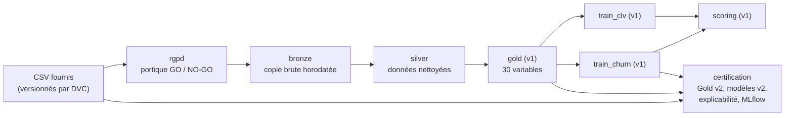

[← Documentation](../index.md)

# Pipeline de données et lignage

## Vue d'ensemble

Les données traversent des couches successives, chacune produite par une étape du pipeline DVC
([`dvc.yaml`](../../dvc.yaml)) et accompagnée d'un **manifeste JSON** écrit par le code, jamais à
la main.



La **v2 en service** (version v2.1 : retards de paiement impossibles neutralisés, voir
[préparation](preparation.md)) est produite par l'étape `certification`, qui exécute le notebook de
certification. Les étapes v1 (`gold` à `scoring`) sont conservées pour comparaison : le notebook
relit le Gold v1 et le modèle v1 pour mesurer ce que la v2 corrige.

## Étapes du pipeline

| Étape DVC | Exécute | Produit (principal) |
|---|---|---|
| `rgpd` | `notebooks/00_conformite_rgpd_anonymisation.ipynb` | `data/rgpd/rgpd_gate_manifest.json` (+ clé et table de pseudonymisation, jamais publiées) |
| `bronze` | `notebooks/01_ingestion_bronze.ipynb` | `data/bronze/*.parquet`, `bronze_manifest.json` |
| `silver` | `notebooks/02_nettoyage_silver.ipynb` | `data/silver/clients_churn_silver.parquet`, `silver_manifest.json` |
| `gold` | `notebooks/03_preparation_gold.ipynb` | Gold v1 et `gold_manifest.json` |
| `train_churn`, `train_clv` | `notebooks/04`, `notebooks/05` | Modèles v1 dans `data/model/` |
| `scoring` | `notebooks/06_implementation_scoring.ipynb` | Règle de décision v1 |
| `certification` | `notebooks/notebook_certifiant_churn_saas.ipynb` | Gold v2, modèles v2, `explication_reference.json`, figures, manifestes et métriques v2 |

Chaque étape écrit la version exécutée de son notebook dans `reports/notebooks/` : c'est la preuve
d'exécution consultable sur GitHub. L'étape `certification` dépend aussi du code qu'elle importe
(`src/*.py`) et de la [base de connaissance](../explicabilite/base_de_connaissance.md) : les modifier
la rend périmée.

## Où sont stockés les fichiers

| Type de fichier | Stockage | Pourquoi |
|---|---|---|
| Parquet, joblib, figures | Cache DVC, poussé sur DagsHub | Volumineux ou binaires |
| Manifestes, métriques, fiches (JSON, Markdown) | Git | Petits et lisibles en diff |
| Clé et table de pseudonymisation | Ni Git ni DVC | Les publier annulerait la pseudonymisation |

## Lignage : prouver quelle donnée a produit quel modèle

Chaque manifeste contient le SHA-256 de ses entrées et de ses sorties. On peut donc remonter du
modèle servi jusqu'au fichier brut :

| Maillon | Où lire l'empreinte |
|---|---|
| CSV brut → Gold v2 | [`gold_v2_manifest.json`](../../data/gold/gold_v2_manifest.json) : champ `sources` |
| Gold v2 | `gold_v2_manifest.json` : `sha256_gold` (`0dcb0bbd…`, version v2.1) |
| Gold v2 → modèle v2 | [`model_manifest.json`](../../data/model_v2/model_manifest.json) : `gold_sha256`, identique à `sha256_gold` |
| Modèle → run d'entraînement | Run MLflow sur DagsHub, étiqueté avec `gold_sha256` et le commit Git |

Les manifestes v1 et la façon de répondre aux questions courantes avec eux sont décrits dans
[`data/README.md`](../../data/README.md). La composition et les choix du Gold v2 sont résumés dans
sa [fiche d'identité](../../data/gold/gold_fiche_identite_v2.md).

## Cycle de vie du jeu de données

Notebook §7.11 : chaque état de la donnée, de l'export brut aux scores.

| Étape | Format et stockage | Conservation aujourd'hui | Accès |
|---|---|---|---|
| Export brut (CSV fournis) | Versionné par DVC, sur DagsHub (stockage objet compatible S3) | Toutes les versions | Équipe data |
| Portique RGPD | Manifeste JSON ; pseudonymisation hors Git et hors DVC | Clé conservée en local uniquement | Équipe data, DPO |
| Bronze, Silver, Gold v2 | Parquet versionné par DVC ; manifestes et empreintes dans Git | Toutes les versions | Équipe data |
| Modèles et règle de décision | joblib et manifestes, runs MLflow | Version en service et précédentes | Équipe data |
| Scores du cycle | Export de 5 colonnes vers le CRM | Écrasés à chaque cycle | Équipes CS |

- **Stockage** : le Parquet en stockage objet suffit à 5 000 comptes traités par lots mensuels ;
  une base relationnelle ne deviendrait utile que pour un scoring en continu
  ([architecture](../exploitation/architecture.md#scénarios-et-contraintes-économiques-notebook-114)).
- **Accessibilité** : `dvc pull` depuis DagsHub, vérifié à chaque push par la CI.
- **Usages futurs** : réentraînement, mesure de la dérive (le train sert de référence), audit
  d'une décision passée.
- **À soumettre au DPO** : les durées de conservation (aujourd'hui, toutes les versions sont
  gardées, ce que la limitation de la conservation du RGPD, article 5.1.e, ne permet pas sans
  justification) et les droits d'accès à la clé de pseudonymisation. Pas encore présenté.

## Commandes utiles

```bash
dvc pull                       # récupère données et modèles depuis DagsHub
dvc status                     # le pipeline est-il à jour ? (étapes périmées)
dvc status -c                  # le cache local est-il synchronisé avec DagsHub ?
dvc repro -s certification     # rejoue seulement le notebook de certification
dvc dag                        # affiche le graphe des étapes
```

> [!IMPORTANT]
> Après toute exécution, vérifier **les deux** : `dvc status` (pipeline) et `dvc status -c`
> (remote). Le second ne dit rien des étapes périmées. Et `dvc repro -f <étape>` sans `-s` force
> aussi toutes les étapes en amont.

Voir aussi : [sources](sources.md) · [préparation](preparation.md) ·
[guide de démarrage](../exploitation/guide_de_demarrage.md)
