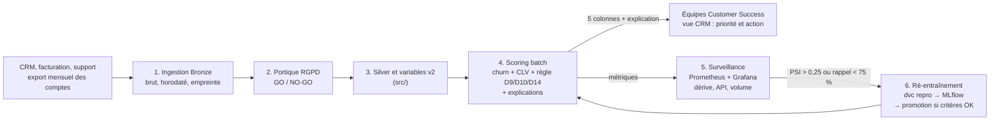

[← Documentation](../index.md)

# Architecture (document d'architecture technique, v2)

Décrit le système **tel qu'il tourne réellement** dans ce dépôt, puis l'architecture cible et
l'écart entre les deux. Remplace le [DAT v1](../archives/v1/dat_churn_saas_v1.md), conservé pour
l'historique.

## Architecture cible : scoring batch mensuel intégré au CRM

Versioning transverse : Git et GitHub (code), DVC et DagsHub (données, modèles), MLflow sur
DagsHub (expériences).

## Ce qui est implémenté

| Brique | Implémentation | Statut |
|---|---|---|
| Ingestion, portique RGPD, Silver, variables | `src/bronze.py`, `notebooks/00`, `src/silver.py`, `src/features.py` | ✅ |
| Modèles churn et CLV (briques 1 et 2) | `data/model_v2/model.joblib`, `model_clv.joblib` | ✅ |
| Système de décision (brique 3) | `src/scoring.py`, `data/model_v2/scoring_manifest.json` | ✅ |
| Explicabilité et base de connaissance | `src/explain.py`, `knowledge/base_connaissance.yaml`, `data/model_v2/explication_reference.json` | ✅ |
| Scoring du cycle mensuel | [`scripts/scorer_cycle.py`](../../scripts/scorer_cycle.py) : portefeuille complet en un lot, capacité D10 appliquée une fois, journal des scores ([runbook](runbook.md)) | ✅ lancé à la main |
| Exposition | API FastAPI en conteneur Docker ([contrat](api.md)) : scoring à la demande ; la capacité D10 s'applique à chaque requête, la liste mensuelle ne passe donc pas par l'API | ✅ |
| Surveillance | Exporteur de dérive, Prometheus, Grafana, alerte PSI ([supervision](supervision.md)) | ✅ sans routage d'alerte |
| Versioning | Git + GitHub, DVC + DagsHub, MLflow sur DagsHub | ✅ |
| Intégration et déploiement continus | GitHub Actions : lint et tests, `dvc pull`, évaluation du modèle livré, construction de l'image, test de `/ready`, publication de l'image sur `ghcr.io` à chaque push sur `main` ([CI](../qualite/integration_continue.md)) | ✅ livraison jusqu'au registre |
| Orchestration du batch mensuel | Aucune : scoring lancé à la demande | ⚠️ à ajouter (planificateur type cron ou Airflow) |
| Intégration CRM réelle | Aucune : export Parquet d'exemple | ⚠️ connecteur à développer |

## Composants déployés (`compose.yaml`)

| Service | Image | Port hôte → conteneur | Rôle |
|---|---|---|---|
| `api` | Cible `runtime` du [`Dockerfile`](../../Dockerfile) | 127.0.0.1:8011 → 8000 | API de scoring, `MODEL_DIR=/app/data/model_v2`, `API_KEY` obligatoire ([sécurité](securite.md)) |
| `drift-exporter` | Même image, autre commande | 127.0.0.1:9111 → 9110 | PSI et test KS par variable, Gold v2 train contre test |
| `prometheus` | `prom/prometheus:v3.1.0` | 127.0.0.1:9092 → 9090 | Collecte des métriques, règle d'alerte |
| `grafana` | `grafana/grafana:11.4.0` | 127.0.0.1:3011 → 3000 | Tableau de bord « Churn SaaS — service & dérive » |
| `pipeline` (profil `pipeline`) | Cible `pipeline` du Dockerfile | — | Rejoue `dvc repro` dans un conteneur |

Ordre de démarrage : Prometheus attend que l'API soit saine et que l'exporteur ait démarré ;
Grafana attend Prometheus.

### Image de l'API

- Base `python:3.13-slim`, utilisateur **non root** (UID 10001), sonde de santé en Python standard
  (pas de `curl` dans l'image).
- `ENV MODEL_DIR=/app/data/model_v2` : l'image sert le modèle v2 même lancée sans variable
  d'environnement (le défaut du code, `data/model`, désigne le modèle v1, refusé par `/ready`).
- Copie **à la construction** : `src/`, `scripts/`, `knowledge/`, `data/model_v2/`, `data/gold/`.
  Un modèle absent au moment de la construction donne un `/ready` en 503 au démarrage ; un modèle
  dont l'empreinte diffère de celle certifiée par le notebook aussi.
- Publiée par la CI sur `ghcr.io/guillaumesaidani-coder/churn_saas` (tags : commit, `latest`).
- Dépendances d'exécution uniquement ([`requirements.txt`](../../requirements.txt)) : FastAPI,
  scikit-learn, pandas, PyYAML, prometheus_client…

## Contraintes (notebook §11.3)

| Contrainte | Exigence | Réponse |
|---|---|---|
| Volumétrie | ~5 000 comptes par mois | Scoring de 5 000 comptes en **0,08 s** (médiane de 5 mesures) : aucune infrastructure distribuée nécessaire |
| Latence | Non critique (batch mensuel) | Batch ; l'API sert aussi un scoring à la demande |
| Poids des modèles | Image légère, démarrage rapide | Modèle CLV v2 de 1,47 Mo, contre 62,5 Mo en v1 |
| Sécurité | Accès restreint | Clé API, limite de débit, taille de requête bornée, conteneur non root ; TLS à ajouter derrière un proxy |
| RGPD | Minimisation, pas de décision automatisée | Export de 5 colonnes, recommandations non exécutoires, clé de pseudonymisation jamais publiée |
| Explicabilité | Les CSM doivent comprendre le score | Explication exacte de chaque priorité ; garde-fou de la base de connaissance |
| Reproductibilité | Rejouer un résultat passé | DVC (données), Git (code), MLflow (runs), graine fixe |

## Scénarios et contraintes économiques (notebook §11.4)

Mesures du rejeu officiel du 3 octobre 2026 : un cycle de scoring de 5 000 comptes prend 0,07 s et
consomme 3,2 mWh (CodeCarbon, estimation). Le coût humain de l'action CS est de 7 500 à 22 500 €
par mois (capacité [D10](../cadrage/decisions/D10.md) × coût d'une relance
[H01](../cadrage/hypotheses.md)), identique dans les trois scénarios.

| Critère | A. Batch mensuel conteneurisé (retenu) | B. Scoring en continu | C. Solution sur étagère |
|---|---|---|---|
| Infrastructure | Un conteneur lancé une fois par mois ; stockage objet | Service permanent, flux d'événements, base opérationnelle | Aucune à opérer ; connecteurs CRM et usage |
| Coût de calcul | 1,0 s par an | 8 760 h par an, environ 32 millions de fois le batch | Inclus dans la licence |
| Coût récurrent dominant | Maintenance (dérive, réentraînement sur déclencheur) | Exploitation en continu, en plus de la maintenance | Licence |
| Apport métier | Aligné sur le cycle mensuel et la capacité CS | Faible : un score plus frais ne crée pas de capacité | À vérifier (fuite, système de décision) |
| Risques | Score daté jusqu'au cycle suivant | Complexité, surface d'attaque | Dépendance à l'éditeur, données chez un tiers |

Le calcul ne départage pas les scénarios ; le coût dominant est humain. Le scénario A est retenu.

**Coût complet d'un cycle du scénario A** (hypothèse [H07](../cadrage/hypotheses.md), notebook
§12.3.1) : 150 appels, 1 753 emails à 5 à 15 €, construction de 15 000 € amortie sur 12 cycles,
exploitation de 1 000 € par cycle, soit **18 515 à 51 045 € par cycle**. Il est remboursé dès que
**0,05 à 0,15 %** de la valeur couverte par les appels est préservée : c'est ce seuil de
rentabilité, et non un ratio de retour, qui est retenu
([système de décision](../modeles/systeme_de_decision.md)).
**À chiffrer par les acteurs** (tarifs inconnus dans cet exercice, non inventés) : l'hébergement
du scénario A par la DSI, les licences du scénario C par les achats ; la direction CS confirme que
le rythme mensuel suffit.

## Ce qui n'existe pas (choix, pas oublis)

| Élément absent | Conséquence | Piste |
|---|---|---|
| Orchestration planifiée | Le cycle mensuel est lancé à la main | Planificateur appelant la chaîne de scoring ([runbook](runbook.md)) |
| Gouvernance de release | Pas de statut candidat / approuvé / actif ; le modèle de `MODEL_DIR` est de fait le modèle actif | Registre de modèles MLflow |
| Multi-environnement | Un seul environnement local et Compose ; l'image publiée n'est déployée nulle part automatiquement | Staging et production séparés, déploiement depuis le registre |
| Routage des alertes | La règle passe à « firing » dans Prometheus sans destinataire | Alertmanager |
| Journal des scores de l'API | L'API ne conserve rien ; le journal existe pour le cycle batch ([`scripts/scorer_cycle.py`](../../scripts/scorer_cycle.py), [runbook](runbook.md)) | Journaliser aussi les appels à `/score-batch` |
| Base relationnelle | Parquet en couches | Non nécessaire à cette volumétrie |

Voir aussi : [contrat d'API](api.md) · [supervision](supervision.md) · [runbook](runbook.md) ·
[pipeline de données](../donnees/pipeline_et_lignage.md)
