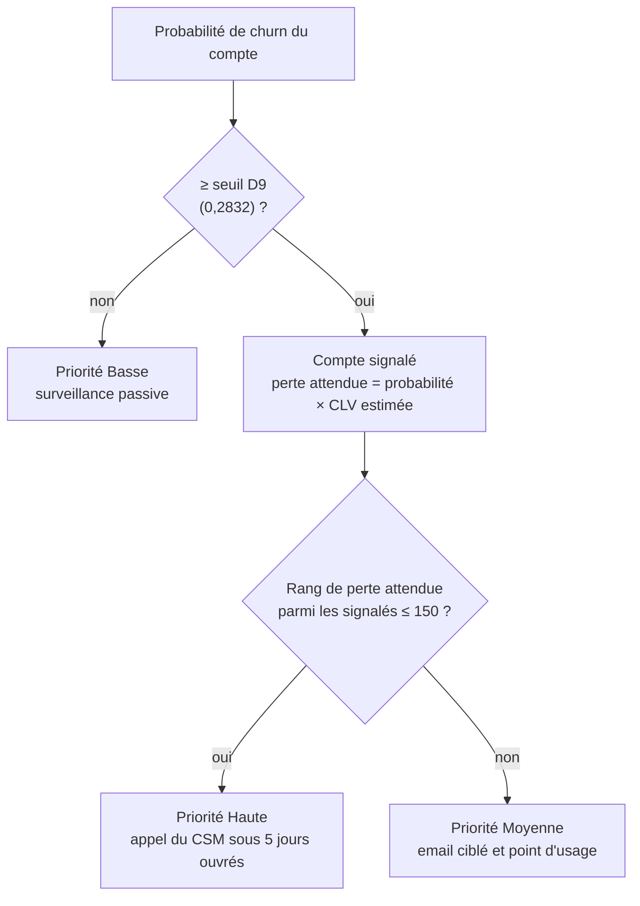

[← Documentation](../index.md)

# Système de décision (brique 3)

Le système de décision transforme les deux prédictions (probabilité de churn, CLV estimée) en une
**liste de travail** pour les équipes Customer Success. Il n'apprend rien : ce sont des règles
métier, dont les paramètres sont figés dans
[`scoring_manifest.json`](../../data/model_v2/scoring_manifest.json) et appliqués par
[`src/scoring.py`](../../src/scoring.py).

## Les règles

| Règle | Paramètre | Valeur |
|---|---|---|
| [D9](../cadrage/decisions/D09.md) Signalement | `seuil_D9_valeur` | **0,2832** (rappel cible 80 %, calculé hors pli sur l'entraînement) |
| [D14](../cadrage/decisions/D14.md) Ordre de priorité | `formule_priorite_D14` | perte attendue = score de churn × valeur vie estimée |
| [D10](../cadrage/decisions/D10.md) Capacité | `capacite_csm_D10` | **150** comptes en priorité Haute par cycle |
| [D11](../cadrage/decisions/D11.md) Actions | `catalogue_actions_D11` | Haute : appel ; Moyenne : email et point d'usage ; Basse : surveillance passive |
| [D3](../cadrage/decisions/D03.md) Pas d'action automatique | — | vérifié par `action_est_conforme_d3` |

Le seuil n'est **jamais recalculé** au moment du scoring : le churn réel n'y est, par définition,
pas connu. `calibrer_seuil_d9` ne sert que hors ligne, sur un cycle dont les issues sont connues.

## Ce qui sort du système

| Sortie | Contenu | Destinataire |
|---|---|---|
| Export CRM (5 colonnes) | `client_id`, `score_churn`, `valeur_vie_estimee_eur`, `priorite`, `action_recommandee` | Équipes CS, via le CRM (minimisation RGPD) |
| Réponse de l'API | Les mêmes champs + `perte_attendue_eur`, et sur demande l'explication | Intégration CRM ([contrat d'API](../exploitation/api.md)) |
| Explication | 3 facteurs de hausse, 3 de baisse, trace de la règle, avertissements | CSM ([lire une explication](../explicabilite/lire_une_explication.md)) |

## Résultats sur le cycle simulé (1 000 comptes du test)

Répartition : 365 comptes signalés sur 1 000, dont **150 en Haute** et 215 en Moyenne ; 635 en
Basse.

| Choix des 150 comptes à appeler | Comptes réellement partis parmi eux |
|---|---|
| **Système de décision** (priorité Haute) | **102** (précision 68 %) |
| Au hasard (espérance) | 42 |
| Les 150 plus gros revenus mensuels | environ 3 fois moins que le système |
| Baseline métier D8 | moins que le système, et des comptes de plus faible valeur |

Les 150 priorités Hautes captent **82 %** de la perte réelle du cycle (98 % au maximum avec 150
comptes). Même avec les hypothèses les plus prudentes (taux de succès des relances de 10 %,
[H05](../cadrage/hypotheses.md), et relance à 150 €), le gain net estimé reste positif. Ces chiffres
sont **estimés** : seul le groupe témoin ([D12](../cadrage/decisions/D12.md)) mesurera l'impact réel.

## Recette D15 : partiellement satisfaite

| Critère | Résultat |
|---|---|
| (a) Perte attendue = score × CLV | Respecté |
| (b) Spearman ≥ 0,7 entre perte attendue et perte réelle | **0,29 : non respecté.** 72 % des pertes réelles sont nulles, ce qui écrase la corrélation globale ; parmi les comptes partis, Spearman ≈ 0,85 |
| (c) Aucun faux négatif à forte perte réelle | **Non respecté** : 14 comptes, sans aucun signal de désengagement dans les données ([explication](../explicabilite/controles.md)) |

**Propositions soumises au métier** (sans modifier le critère après coup) : remplacer (b) par la
**part de la perte réelle captée par la priorité Haute** ; ajouter un **filet de sécurité** qui
ferait passer en Moyenne les comptes sous le seuil dont la perte attendue dépasse celle du
150ᵉ compte Haut. Ces deux évolutions touchent D14 et D15 : elles relèvent d'un arbitrage métier.

## Limites

- La capacité s'applique au **lot scoré** : pour que « 150 » ait son sens, il faut scorer le cycle
  complet en un seul lot.
- Un compte de très grande valeur mais sous le seuil n'entre jamais dans la liste (D14).
- Seuil et capacité sont figés : ils doivent être revus à chaque ré-entraînement
  ([runbook](../exploitation/runbook.md)).

Voir aussi : [model card churn v2](model_card_churn_v2.md) · [model card CLV v2](model_card_clv_v2.md)
