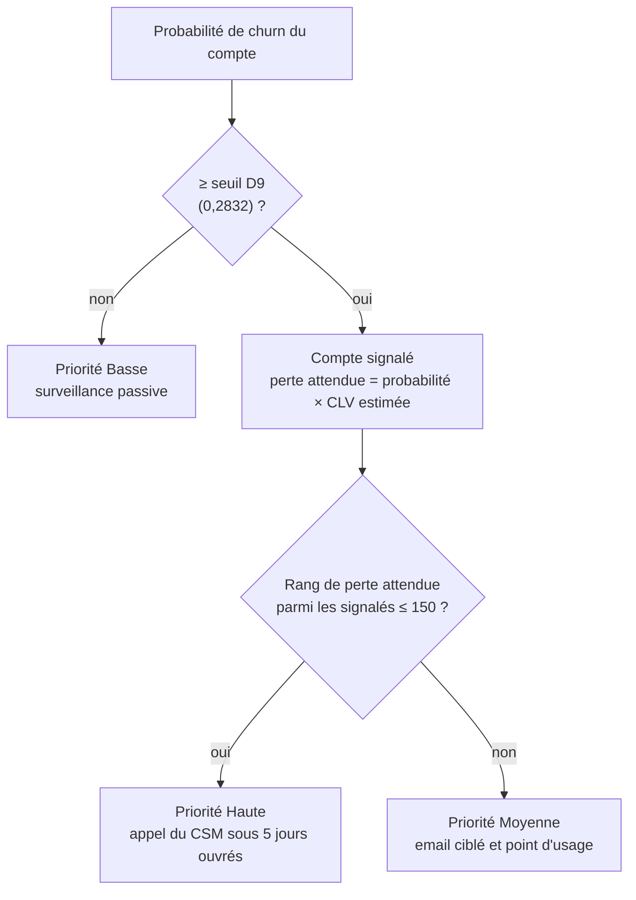

[← Documentation](../index.md)

# Système de décision (brique 3)

Le système de décision transforme les deux prédictions (probabilité de churn, CLV estimée) en une
**liste de travail** pour les équipes Customer Success. Il n'apprend rien : ce sont des règles
métier, dont les paramètres sont figés dans
[`scoring_manifest.json`](../../data/model_v2/scoring_manifest.json) et appliqués par
[`src/scoring.py`](../../src/scoring.py).

## Les règles

| Règle | Paramètre | Valeur |
|---|---|---|
| [D9](../cadrage/decisions/D09.md) Signalement | `seuil_D9_valeur` | **0,2832** (rappel cible 80 %, calculé hors pli sur l'entraînement) |
| [D14](../cadrage/decisions/D14.md) Ordre de priorité | `formule_priorite_D14` | perte attendue = score de churn × valeur vie estimée |
| [D10](../cadrage/decisions/D10.md) Capacité | `capacite_csm_D10` | **150** comptes en priorité Haute par cycle |
| [D11](../cadrage/decisions/D11.md) Actions | `catalogue_actions_D11` | Haute : appel ; Moyenne : email et point d'usage ; Basse : surveillance passive |
| [D3](../cadrage/decisions/D03.md) Pas d'action automatique | — | vérifié par `action_est_conforme_d3` |

Le seuil n'est **jamais recalculé** au moment du scoring : le churn réel n'y est, par définition,
pas connu. `calibrer_seuil_d9` ne sert que hors ligne, sur un cycle dont les issues sont connues.

## Ce qui sort du système

| Sortie | Contenu | Destinataire |
|---|---|---|
| Export CRM (5 colonnes) | `client_id`, `score_churn`, `valeur_vie_estimee_eur`, `priorite`, `action_recommandee` | Équipes CS, via le CRM (minimisation RGPD) |
| Réponse de l'API | Les mêmes champs + `perte_attendue_eur`, et sur demande l'explication | Intégration CRM ([contrat d'API](../exploitation/api.md)) |
| Explication | 3 facteurs de hausse, 3 de baisse, trace de la règle, avertissements | CSM ([lire une explication](../explicabilite/lire_une_explication.md)) |

## À l'échelle de la production : 150 appels sur 5 000 comptes

La décision n'appelle que **3 %** du portefeuille. On la juge sur la **perte captée** : la part de
la perte réelle (churn × CLV réelle) portée par les comptes appelés. Deux mesures, à capacité
proportionnelle : hors pli sur les 4 000 comptes du train (120 appels, notebook §9.8) et sur le test
(30 appels sur 1 000, §12.3.1). L'**oracle** est la meilleure liste possible, avenir connu.

| Liste d'appels (3 %) | Perte captée hors pli | Précision des appels |
|---|---|---|
| **Règle D14** (régression logistique, filtre D9, tri par perte attendue) | **47 %** (IC 37 à 56 %) | **69 %** |
| Forêt aléatoire, règle D14 | 47 % | |
| Gradient boosting, règle D14 | 46 % | |
| Règle métier D8 calibrée, règle D14 | 48 % | 40 % |
| Régression logistique sans le filtre D9 | 55 % (écart de +1 à +18 points) | 63 % |
| Oracle | 76 % | |

Sur le test, avec 30 appels sur 1 000 : **59 %** de la perte réelle (IC 46 à 70 %), soit 80 % de
l'oracle (74 %) ; 23 comptes partis appelés, 7,2 M€ de perte couverte, contre 5,5 M€ pour la règle
métier × CLV et 3,7 M€ pour les plus gros revenus.

**Ce qui ordonne la liste.** Parmi les comptes signalés, la variance du log de la CLV estimée vaut
24 fois celle du log de la probabilité ; 84 % de la liste est celle qu'on obtiendrait en triant par
CLV seule. Sur la valeur captée, les familles de modèles et la règle font jeu égal. Ce que le modèle
de churn apporte à la décision : la **précision des appels**, des **probabilités calibrées**
(exigées par le produit p × CLV) et l'**explication** de chaque priorité.

**Le filtre D9 coûte de la valeur** : sans lui, 55 % au lieu de 47 %, pour 6 points de précision en
moins. La règle est conservée (option (a)) ; ce compromis est un arbitrage pour la direction CS, et
un critère unique de gain attendu est recommandé pour la v3 ([D9](../cadrage/decisions/D09.md)).

La mesure est très variable : 1 % des comptes portent 52 % de la perte réelle ; d'un échantillon à
l'autre, la part captée varie d'environ ±10 points.

## Retour sur investissement : le seuil de rentabilité

Un ratio de retour dépend du taux de succès inconnu ([H05](../cadrage/hypotheses.md)) et de la
définition de la valeur en jeu. On retient donc le **seuil de rentabilité** : la part de la valeur
couverte qu'il suffit de préserver pour rembourser les coûts (notebook §12.3.1).

| Périmètre | Coût | Seuil de rentabilité |
|---|---|---|
| Les 150 appels seuls ([H01](../cadrage/hypotheses.md), test) | 7 500 à 22 500 € | **0,07 à 0,22 %** de la valeur couverte ; un seul compte médian de la liste (26 377 €) suffit |
| Cycle de production complet ([H07](../cadrage/hypotheses.md)) : 150 appels, 1 753 emails, construction amortie, exploitation | 18 515 à 51 045 € par cycle | **0,05 à 0,15 %** |

Les ratios de retour (67 à 562 fois la mise selon H05) sont élevés parce que les CLV du jeu le sont,
et la CLV inclut probablement du revenu déjà encaissé : seul le seuil de rentabilité est à retenir.
Il resterait sous 2 % avec une valeur en jeu dix fois plus faible. Le bénéfice des emails n'est pas
compté.

## Résultats sur le cycle simulé (1 000 comptes du test, 150 appels = 15 %)

Répartition : 365 comptes signalés sur 1 000, dont **150 en Haute** et 215 en Moyenne ; 635 en
Basse.

| Choix des 150 comptes à appeler | Comptes réellement partis parmi eux |
|---|---|
| **Système de décision** (priorité Haute) | **102** (précision 68 %) |
| Au hasard (espérance) | 42 |
| Les 150 plus gros revenus mensuels | environ 3 fois moins que le système |
| Baseline métier D8 | moins que le système, et des comptes de plus faible valeur |

Les 150 priorités Hautes captent **82 %** de la perte réelle du cycle (IC 72 à 90 % ; 98 % au
maximum avec 150 comptes). Ce chiffre vaut pour une capacité de 15 %, cinq fois celle de la
production (voir plus haut). Même avec les hypothèses les plus prudentes (taux de succès des relances de 10 %,
[H05](../cadrage/hypotheses.md), et relance à 150 €), le gain net estimé reste positif. Ces chiffres
sont **estimés** : seul le groupe témoin ([D12](../cadrage/decisions/D12.md)) mesurera l'impact réel.

## Recette D15 : critère d'origine non respecté, critères révisés

| Critère | Résultat |
|---|---|
| (a) Perte attendue = score × CLV | Respecté |
| (b) Spearman ≥ 0,7 entre perte attendue et perte réelle | **0,29 : non respecté.** 72 % des pertes réelles sont nulles, ce qui écrase la corrélation globale ; parmi les comptes partis, Spearman ≈ 0,85 |
| (c) Aucun faux négatif à forte perte réelle | **Non respecté** : 14 comptes, sans aucun signal de désengagement dans les données ([explication](../explicabilite/controles.md)) |

**Arbitrage du 3 octobre** : (b) et (c) sont remplacés par (b') part de la perte réelle captée
par la priorité Haute **≥ 75 %** (82 % sur le test) et (c') part des comptes partis à forte perte
couverts par Haute ou Moyenne **≥ 85 %** (80 % sans filet, 91 % avec). Le **filet de sécurité**
est adopté ([D14](../cadrage/decisions/D14.md)) : un compte sous le seuil passe en Moyenne si sa
perte attendue dépasse celle du dernier compte Haute du lot. Les nouveaux critères valent à
partir du premier cycle réel ([D15](../cadrage/decisions/D15.md)).

À l'échelle de la production, même l'oracle ne capte que 74 à 76 % de la perte réelle : le seuil de
75 % de (b') y est inatteignable. (b') doit être réexprimé en **part de l'oracle** (80 % sur le test,
62 % hors pli), avec un seuil fixé par la direction CS avant le premier cycle réel.

## Limites

- La capacité s'applique au **lot scoré**, donc à chaque requête de l'API : la liste mensuelle passe
  par le scoring batch du portefeuille complet ([`scripts/scorer_cycle.py`](../../scripts/scorer_cycle.py)).
- Le filtre D9 ignore la valeur (arbitrage ci-dessus).
- Le filet de sécurité ([D14](../cadrage/decisions/D14.md)) dépend de la taille du lot : 135 comptes ajoutés sur le cycle de test de 1 000 comptes, 38 sur le cycle simulé de 5 000 comptes du mois suivant, 47 sur le portefeuille observé.
- Seuil et capacité sont figés : ils doivent être revus à chaque ré-entraînement
  ([runbook](../exploitation/runbook.md)).

Voir aussi : [model card churn v2](model_card_churn_v2.md) · [model card CLV v2](model_card_clv_v2.md)
