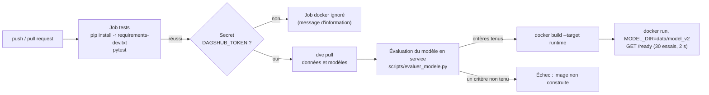

[← Documentation](../index.md)

# Intégration continue

Workflow GitHub Actions [`.github/workflows/ci.yml`](../../.github/workflows/ci.yml), déclenché à
chaque push sur `main`, à chaque pull request, et à la demande.

| Job | Étapes | Ce qu'il garantit |
|---|---|---|
| `tests` | Installation de l'environnement complet, `python -m pytest -q` | Les 189 tests passent sur Linux, Python 3.13 |
| `docker` | `dvc pull` depuis DagsHub, **évaluation du modèle en service** sur le jeu de test (rapport `evaluation-modele` en artefact du run), construction de l'image d'exécution, démarrage, interrogation de `/ready` | Le modèle livré tient ses critères ([D8](../cadrage/decisions/D08.md), rappel au seuil [D9](../cadrage/decisions/D09.md), calibration, aucun contrôle bloquant) et redonne les métriques publiées dans `metrics.json` ; l'image démarre avec les **vrais** modèles v2 |

## Secret requis

`DAGSHUB_TOKEN` (Settings → Secrets and variables → Actions du dépôt GitHub). Sans lui, le job
`docker` affiche un message et s'arrête sans échec : les tests unitaires restent exécutés.

## Ce que la CI ne fait pas

- Elle ne rejoue pas le notebook de certification (trop long, et il publierait des runs MLflow) :
  c'est `dvc repro -s certification`, lancé à la main, qui le fait.
- Elle n'entraîne pas de challenger : la comparaison (`scripts/challenger.py`) se lance au
  ré-entraînement ([runbook](../exploitation/runbook.md) §3).
- Elle ne publie ni image ni modèle : pas de déploiement continu.
- Elle suppose que les sorties DVC sont sur DagsHub : après une exécution qui modifie un modèle,
  faire `dvc push` **avant** `git push`, sinon `dvc pull` échoue dans la CI.

Voir aussi : [cahier de tests](cahier_de_tests.md) · [runbook](../exploitation/runbook.md)
